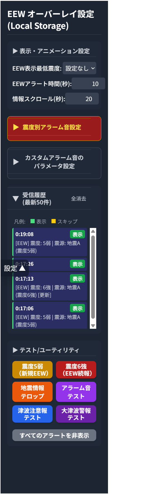

# リアルタイム地震・津波情報オーバーレイ for OBS

## 概要

このツールは、P2P地震情報 API v2 からリアルタイムで緊急地震速報（EEW）、地震情報、津波情報を取得し、OBSなどの配信ソフトウェア上にオーバーレイ表示するためのWebアプリケーションです。

震度や警報レベルに応じた多彩なアラート表示や、詳細な音声通知設定により、視聴者に分かりやすく情報を伝えることを目的としています。

  
*(この部分は後で実際の動作画面のスクリーンショットに差し替えてください)*

---

## 主な機能

- **リアルタイム情報受信**: WebSocketを利用して、以下の情報をリアルタイムで取得・表示します。
  - **緊急地震速報 (EEW)**
  - **地震情報**
  - **津波情報** (大津波警報・津波警報・津波注意報)

- **緊急地震速報 (EEW) アラート**:
  - 予想最大震度に応じて背景色やアニメーションが変化するアラートを表示します。
    - **震度3以上**: オレンジ
    - **震度5弱以上**: 赤オレンジ
    - **震度6弱以上**: 濃い赤 + 揺れアニメーション
  - 続報を受信した場合は、アラート内容が更新されます。

- **津波情報アラート (二段階表示)**:
  1.  **速報オーバーレイ**: 警報レベルに応じて色分けされたアラートを画面上部に表示します。
      - **大津波警報**: 背景: 紫 / 文字: 白
      - **津波警報**: 背景: 赤 / 文字: 白
      - **津波注意報**: 背景: 黄 / 文字: 黒
  2.  **詳細情報テロップ**: 上記の速報アラートが消えた後、各地の到達予想時刻や津波の高さを画面下部のテロップで繰り返し表示します。

- **地震情報テロップ**:
  - 震度3以上の地震情報を受信した際や、EEWアラート表示後に、画面下部にニュース速報風のスクロールテロップを表示します。
  - 津波情報テロップが表示されている間は、地震情報テロップは表示されません。

- **高度な音声通知**:
  - 震度階級（4以下 / 5弱・5強 / 6弱以上）ごとに異なるアラーム音を設定可能です。
  - 内蔵音源（EEW標準音、サイレン等）に加え、**カスタム音源**にも対応しています。
    - **シンセサイザー**: 周波数やテンポを調整して独自の警告音を作成できます。
    - **外部URL**: CORS対応の音声ファイル（mp3, wav等）を直接指定できます。

- **詳細な設定パネル**:
  - 表示する最低震度、アラート表示時間、テロップのスクロール速度などを細かく調整できます。
  - 全ての設定はブラウザの **LocalStorage** に自動で保存され、次回起動時も維持されます。

- **受信履歴**:
  - 受信した情報の履歴（時刻、震源、最大震度）と、実際に表示されたかどうかのステータス（表示/スキップ）を一覧で確認できます。

- **テスト機能**:
  - 実際に災害が発生していなくても、各種アラート（EEW、津波注意報、大津波警報など）やアラーム音の動作をいつでも確認できます。

---

## セットアップ方法 (OBSでの利用)

1.  **ファイルの配置**:
    - このリポジトリにある `index.html` ファイルをPCの任意の場所（例: `C:\OBS_Tools\eew_overlay\index.html`）に保存します。

2.  **OBSにブラウザソースを追加**:
    - OBSの「ソース」パネルで「+」をクリックし、「ブラウザ」を選択します。
    - 好きな名前（例: "地震情報アラート"）を付けます。

3.  **ブラウザソースの設定**:
    - **`☑ ローカルファイル`** にチェックを入れます。
    - 「参照」ボタンを押し、先ほど保存した `index.html` ファイルを選択します。
    - **`幅`** と **`高さ`** を配信画面の解像度（例: `1920` x `1080`）に設定します。
    - **`☑ OBS経由で音声を制御する`** にチェックを入れます。（**非常に重要です！**）
    - 「OK」を押して設定を完了します。

4.  **動作確認と初期設定**:
    - OBSに追加したブラウザソースを右クリックし、「**対話**」を選択します。
    - 専用の設定パネルが表示されます。ここでアラートの表示条件や音などを自由にカスタマイズしてください。
    - 「テスト/ユーティリティ」セクションのボタンを押し、アラートが正しく表示・再生されるか確認します。
    - 設定は自動的に保存されるため、一度設定すれば完了です。

---

## 設定項目ガイド

設定パネル（画面左側の「設定 ▼」ボタン）で以下の項目を調整できます。

### 表示・アニメーション設定
- **EEW表示最低震度**: ここで設定した震度以上のEEWのみが画面に表示されます。
- **EEWアラート時間(秒)**: アラートが画面に表示され続ける時間です。0にすると手動で消すまで表示されます。
- **情報スクロール(秒)**: 地震情報テロップが画面を1周するのにかかる時間です。値が小さいほど速くなります。

### 震度別アラーム音設定
- 震度階級ごとに再生するアラーム音を選択できます。
- 「ミュート」を選択するとその階級では音が鳴らなくなります。

### カスタムアラーム音のパラメータ設定
- **カスタムトーン**: シンセサイザー音の音程（周波数）やテンポを調整できます。
- **URL音源**: 外部の音声ファイルをURLで指定します。
  - **注意**: 音声ファイルを置いているサーバーが **CORS** (`Access-Control-Allow-Origin: *`) に対応している必要があります。DropboxやGoogle Driveの共有リンクは直接は使えません。

### 受信履歴
- WebSocketで受信した情報のログが表示されます。
- **凡例**:
  - ■ **表示**: アラートやテロップが画面に表示されたもの。
  - ■ **スキップ**: 受信はしたものの、設定により表示されなかったもの。

---

## ライセンス

このプロジェクトは MIT License の下で公開されています。
